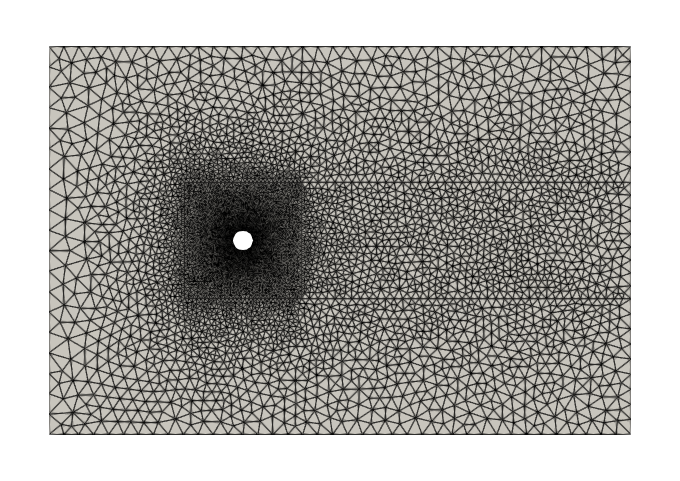
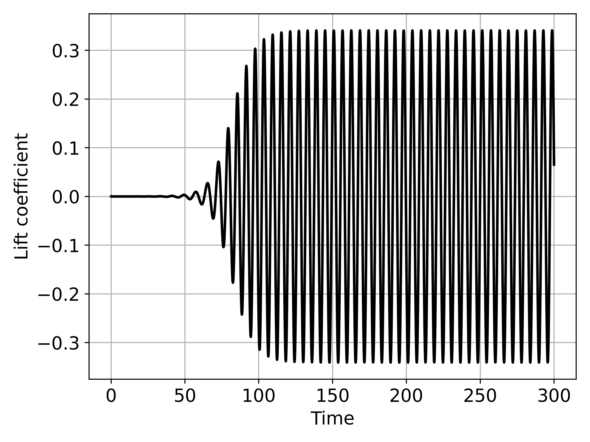
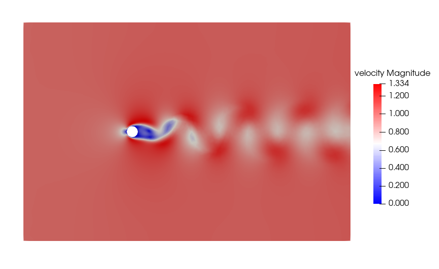
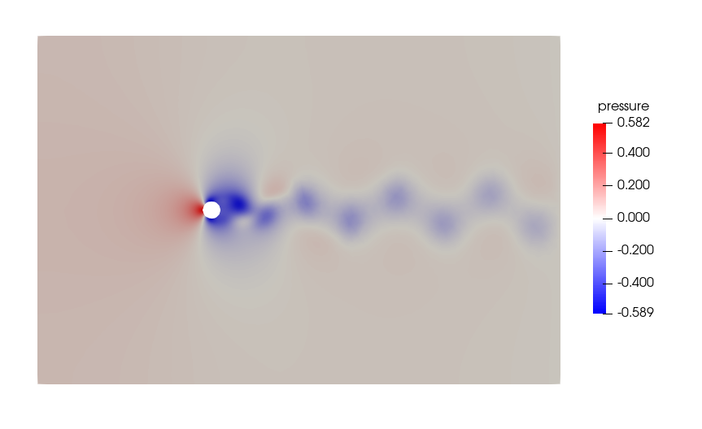

# CFDwithFEniCSx
Computational Fluid Dynamics with FEniCSx library.

* Meshes are generated using GMSH.
* The formulation is coupled velocity-pressure formulation with Taylor-Hood (P2-P1) elements.
* Time integration scheme is the generalised-alpha scheme, which is second-order accurate and unconditionally stable.

## Flow past a fixed circular cylinder
### Mesh used

### Lift coefficient obtained with a time step of 0.1 s.

### Contour plots of velocity and pressure at 300 seconds.

